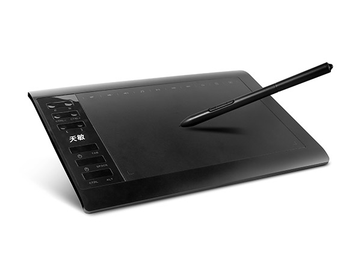

# 10moons-driver-vin1060plus



[10moons Graphics Tablet product homepage](http://eng.10moons.com/info5494.html)

[Aliexpress equivalent sold under VINSA brand. --- Download User Manual](https://web.archive.org/web/20240609200158/http://blog.ping-it.cn/h/8/sms.pdf)

This is a Simple driver with pyUSB code modified to handle the interaction events of the VINSA 1060Plus graphics tablet, that includes a passive two button pen.

Linux detects it as a T501 GoTOP tablet, hence pyUSB library is able to interface with the tablet device.

## ❓ About

This repository is a driver that provides basic functionality for VINSA 1060plus T501 tablet

> May also work with other similar models, but not tested yet
> *(for other models you can try modifying config file and make a contribution)*
>
> Tested on 10moons G10 v2.0 (*product code:* `6970607220191`, *detected by* `lsusb` *as:* `08f2:6811`)

### ✨ Features

- No `10moons-tools` needed
- X / Y positioning with limiting
- Pressure sensitivity and calibration (**no linearity correction yet**)
- Configurable touch thresholds
- Debug mode
- Configurable evdev's UInput actions:
  - Pen (stylus) buttons
  - 12 buttons on the tablet itself

## 🏗️ How to install and use

> ⚠️ **You need to connect your tablet and run the driver prior to launching a drawing software otherwise the device will not be recognized by it**

### 1. Clone this repo

```shell
git clone https://github.com/F33RNI/10moons-driver-vin1060plus.git
cd 10moons-driver-vin1060plus
```

### 2. Create python's virtual environment and install requirements

> **NOTE:** Tested on Python `3.12.7`

```shell
python -m venv venv
source venv/bin/activate
pip install -r requirements.txt
```

### 3. Connect your tablet and wait a little while until it is detected by the system

### 4. Start driver in debug mode

```shell
sudo venv/bin/python driver.py -d
```

### 5. Calibrate pressure

1. Hover pen over tablet without touching it and write down `[RAW] Pressure: <-` value
2. Now, touch tablet as hard as you can and write down `[RAW] Pressure: <-` value again
3. Stop driver by pressing `CTRL` + `C`
4. Put these values into `pressure_in_min` and `pressure_in_max` inside config file
5. Start driver again in debug mode
6. Determine pressure at which you want touch / release to be registered using value from `[OUT] X: ..., Y: ..., pressure: <-`
7. Stop driver by pressing `CTRL` + `C`
8. Edit `pressure_threshold_press` and `pressure_threshold_release` in config file if needed

### 6. Start driver in normal mode

```shell
sudo venv/bin/python driver.py
```

> **NOTE:** You can provide path to config file with `-c [CONFIG]` argument
>
> **NOTE:** You can enable debug mode in config file itself
>
> **NOTE:** In case of errors after restarting driver, try reconnecting the tablet or restarting your computer
  
### 💻 In case of multiple monitors connected

> Not tested
  
#### 1. run `xrandr` to identify the name of the Display that you want to limit your tablet x & y coords

*e.g.:*

```text
DisplayPort-1
```

#### 2. run `xinput` to list all virtual devices,  identify the virtual core pointer associated with tablet pen

*e.g.:*

```text
↳ 10moons-pen Pen (0)                      id=17 [slave  pointer  (2)]
```

#### 3. configure xinput to restrict x&y coords to relevant monitor

*e.g.:*

```shell
xinput map-to-output 17 DisplayPort-1
```

## ⚙️ Configuring tablet

Configuration of the driver placed in `config-vin1060plus.yml` file

You can provide path to it using `-c` argument

> **Pls read config file with it's comments for more info**

## 🔳 Changing Button/Key shortcuts

`config-vin1060plus.yml` contains a Key code list (`tablet_buttons` variable) that allows the user to edit the 12 buttons found on the left-side of the graphics tablet.

To list all the possible key codes you may run:

```shell
python -c "from evdev import ecodes; print([x for x in dir(ecodes) if 'KEY' in x])"
```

`config-vin1060plus.yml` also contains a BTN code list (`pen_buttons` variable) that allows the user to edit the 2 buttons found on passive stylus pen.

To list all the possible Mouse/Stylus BTN codes you may run:

```shell
python -c "from evdev import ecodes; print([x for x in dir(ecodes) if 'BTN' in x])"
```

> Useful Doc explaining how the Kernel categorises and uses those ecodes:
  <https://www.kernel.org/doc/Documentation/input/event-codes.txt>
>
> Input-Event-codes Src from Github:
  <https://github.com/torvalds/linux/blob/master/include/uapi/linux/input-event-codes.h>

You can also use multiple keys at the same time separated with `+`

For example, to bind `CTRL` + `Z` on `CTRL` button (bottom left):

```yaml
actions:
    ...
    tablet_buttons:
        ...
        # Labelled as 'CTRL'
        63283: KEY_LEFTCTRL+KEY_Z
```

## 📜 The progress so far

### History of development

- Started as 10moons-driver by [Alex-S-V](https://github.com/alex-s-v/10moons-driver)
- Forked by [f-caro](https://github.com/f-caro/10moons-driver-vin1060plus) and modified for `vin1060plus`
- Refactored by [Fern Lane](https://github.com/F33RNI)

With linux Kernel 5+,  the graphics tablet should be detected but pen movement is restricted to Android Active Area (the small area on the tablet).  That driver was added to the kernel but interacts with the T503 chipset.
Thanks to [Digimend - https://github.com/DIGImend](https://github.com/DIGImend) for providing valuable functionality not just to 10moons Tablets, but to a variety of other popular Tablets.

Unfortuantely, Mr Digimend has chosen not to further develop the driver applicable to VINSA 1060plus, due to the inaccurate information transmitted between the T501 chipset and the USB driver --> [Live recording of Mr DIGIMEND working on 10moons tablet debug and analysis.  Awesome to see the master at work :)](https://www.youtube.com/watch?v=WmnSwjlpRBE).

So an alternative workaround was needed.  In steps Alex-S-V with his pyUSB implementation of the T503 driver --- together with the [Digimend 10moons-Probe tool](https://github.com/DIGImend/10moons-tools),  it has the particular effect of switching the Graphics Tablet out of AndroidActiveArea Mode and into FullTabletArea mode. I will need to ask the original author (Mr.Digimend) how he identified the hex string to transmit to the tablet [ (probe.c src: line#165 ---> SET_REPORT(0x0308, 0x08, 0x04, 0x1d, 0x01, 0xff, 0xff, 0x06, 0x2e); ) ] (<https://github.com/DIGImend/10moons-tools/blob/6cc7c40c50cb58fefe4e732f6a94fac75c9e4859/10moons-probe.c#L165>)

The person to discover this "hack" was Mr.Digimend himself and thanks to the [Youtube video that he uploaded time-stamp @1:40.11](https://youtu.be/WmnSwjlpRBE?t=6011) he shows that usbhid-dump  output when in Android-Active-Area Mode (8 byte TX)  vs  the required  Full-Tablet-Active-Area mode (64 byte TX).

At current state of repo, Fern Lane has refactored the code. She fixed the pressure calculation, moved most of the parameters to a configuration file, making it more universal (with the ability to use it on other similar models), added logs and cli args, made the usage more intuitive, and removed the need for `10moons-tools`.

## 🌐 Credits

> Some parts of code are taken from:
  <https://github.com/Mantaseus/Huion_Kamvas_Linux>
>
> Other parts taken from:  
  <https://github.com/alex-s-v/10moons-driver>
>
> All inspiration tricks and tactics taken from :
  <https://github.com/DIGImend/10moons-tools>
>
> Together with howto videos from DigiMend :  
  <https://www.youtube.com/watch?v=WmnSwjlpRBE>
>
> DigiMend conference talk on interfacing grahics tablets in Linux:  
  <https://www.youtube.com/watch?v=Qi73_QFSlpo>
>
> The forum that got started with finding a simple solution to cheap graphics tablet purchase:  
>
> "Please Add support for 10moons 10*6 inch Graphics Tablet #182"
  <https://github.com/DIGImend/digimend-kernel-drivers/issues/182>

## 📑 TODOS

- Map the 10 "virtual buttons" found on the top-side of the graphics tablet active area: (`mute`, `vol_dwn`, `vol_up`, `music_player`, `play_pause`, `prev_song`, `next_song`, `home_btn`, `calc_btn`, `desktop_view`)

- Allow the Graphics App (e.g. Gimp, Scribus, Pix, Inkscape etc. ) to make use of the "pressure sensitivity" measurement

- Use its linear Z-axis "pressure sensitivity" measurements and map it to a non-linear function (maybe bezzier-curve) that simulates more natural pen strokes

## 🔗 Useful references

- Docs to Python source code of UInput class :  <https://python-evdev.readthedocs.io/en/latest/_modules/evdev/uinput.html>

- pyUSB tutorial howto : <https://github.com/pyusb/pyusb/blob/master/docs/tutorial.rst>

- wireshark tips on howto filter USB traffic ( [better to use the video from Digimend](https://www.youtube.com/watch?v=WmnSwjlpRBE) ) : <https://osqa-ask.wireshark.org/questions/53919/how-can-i-precisely-specify-a-usb-device-to-capture-with-tshark/>  :::   howto configure in Linux : <https://wiki.wireshark.org/CaptureSetup/USB>  :::  tutorial with step-by-step screenshots : <https://github.com/liquidctl/liquidctl/blob/main/docs/developer/capturing-usb-traffic.md>

- PDF USB.org  Device Class Definition for Human Interface Devices Firmware Specification : <https://www.usb.org/sites/default/files/documents/hid1_11.pdf>

- Digimend howto do diagnostics when trying out new tablets in Linux : <http://digimend.github.io/support/howto/trbl/diagnostics/>

- 10moons 10x6 tablet homepage : <http://eng.10moons.com/info5494.html>  :::  picture revealing possible circuit schematic ??  <http://eng.10moons.com/info5494.html>

- libUSB C library initialization/deinitialization : <https://libusb.sourceforge.io/api-1.0/group__libusb__lib.html#details>

- USB in a Nutshell - tutorial/howtos/references : <https://www.beyondlogic.org/usbnutshell/usb1.shtml>
